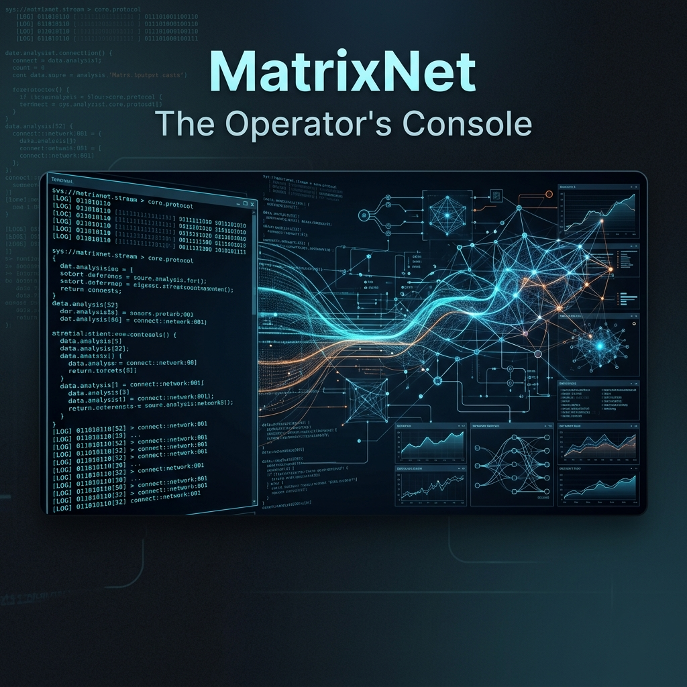

# MatrixNet: The Operator's Console 🌐⚡



## 📋 Table of Contents
- [Overview](#overview)
- [Algorithmic Focus](#algorithmic-focus)
- [Key Features](#key-features)
- [Technical Specifications](#technical-specifications)
- [Installation](#installation)
- [Usage](#usage)
- [Testing](#testing)
- [License](#license)

---

## 🔍 Overview
**MatrixNet** is a graph-theory-based network analysis tool developed for the **CMPE 250 (Data Structures and Algorithms)** course at **Boğaziçi University**. It simulates a high-stakes network environment where an 'Operator' must identify critical nodes, analyze connectivity, and optimize data flows across complex topologies.

## 🧠 Algorithmic Focus
The core of MatrixNet is built on **Graph Theory** and **Connectivity Analysis**:
- **Strongly Connected Components (SCC)**: Implements **Tarjan's Algorithm** to identify isolated or highly connected network clusters.
- **Articulation Points**: Detects critical nodes whose failure would fragment the network.
- **Complexity Optimization**: Engineered to handle massive graphs with $V$ vertices and $E$ edges in $O(V + E)$ time.

## ✨ Key Features
- **Real-time Topology Analysis**: Efficiently parses and analyzes large network graphs.
- **Connectivity Mapping**: Maps out the entire network structure to identify bottlenecks.
- **Performance Benchmarking**: Integrated tools to compare different algorithmic approaches (e.g., recursive vs. iterative Tarjan).
- **Automated Validation**: Robust test suite included for verifying edge cases in network topology.

## 🛠️ Technical Specifications
- **Language**: Java 17
- **Data Structures**: Adjacency Lists, Stacks for SCC traversal, and optimized Bitsets for state tracking.
- **Optimization**: Minimizes garbage collection overhead by reusing data structures and avoiding redundant object creation.

## 🚀 Installation
1. Ensure you have **Java JDK 17+** installed.
2. Clone the repository:
   ```bash
   git clone https://github.com/yigitsarpavci/MatrixNet-The-Operator-s-Console.git
   ```
3. Navigate to the project directory:
   ```bash
   cd MatrixNet-The-Operator-s-Console
   ```

## 💻 Usage
Compile the source:
```bash
javac src/*.java -d bin/
```
Run the console:
```bash
java -cp bin Main input.txt output.txt
```

## 🧪 Testing
The project includes a multi-approach testing suite:
- Run automated tests: `python3 tests/test_runner.py`
- Benchmarking logs are available in `docs/logs/` (comparing Tarjan-based vs. alternate implementations).
- Detailed assignment specifications are in `docs/cmpe250_project3_matrixnet_description_v2.pdf`.

## 📄 License
This project is licensed under the **MIT License**. See the [LICENSE](LICENSE) file for details.

---
*Developed with ❤️ by Yiğit Sarp Avcı*
